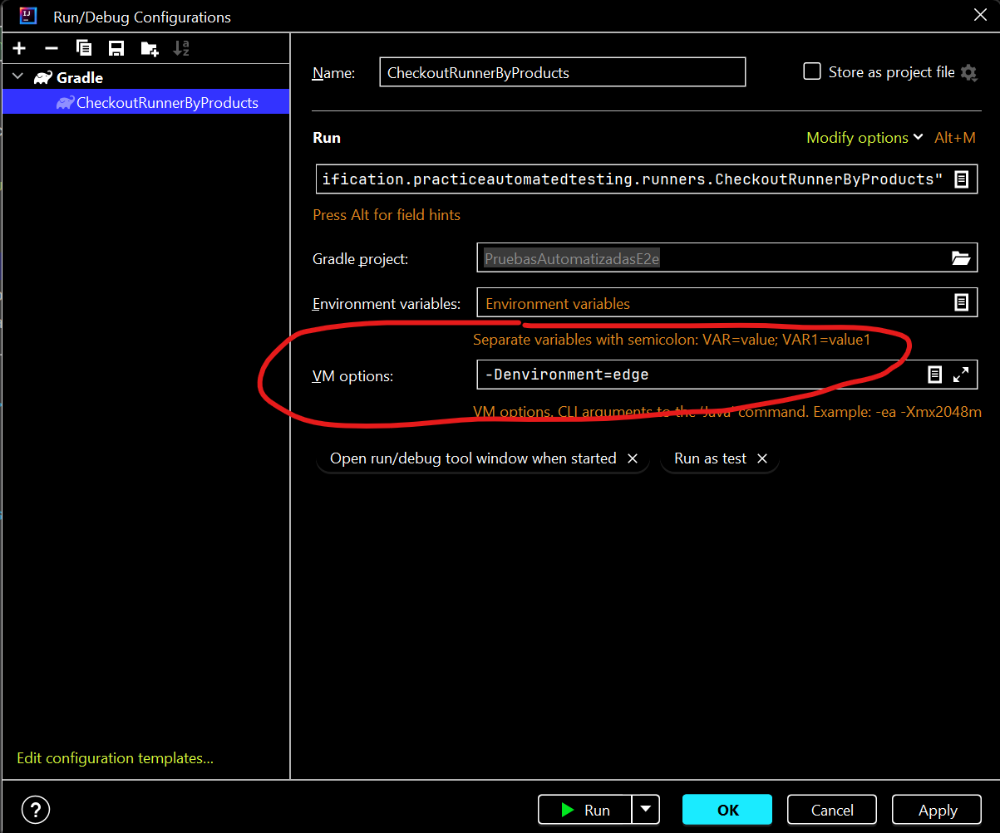

<h1 style="text-align: center;">Automated E2E GUI testing project in Java</h1>


### CONTENT

* [Introduction](#introduction).
* [Requirements](#requirements).
* [Recommended](#recommended).
* [Configuration](#configuration).
* [Troubleshooting](#troubleshooting).
* [Maintainers](#maintainers).

### INTRODUCTION

Automated E2E GUI testing project in Java for a purchase flow on the https://www.saucedemo.com/ website.

#### The project directory structure
The project has build scripts for Gradle, and follows the standard directory structure used in serenity projects:
```text
src
  + main
  + test
    + java
      + co
        + com
          + certification
            + practiceautomatedtesting
              + runners
              + stepdefinitions
    + resources
      + features                  Feature files
```

```text
Feature: buy products on the website

  @check-product-purchase
  Scenario Outline: check product purchase

    Given the user accesses to the website
    And the user logs in with username "<user>" and password "<password>"
    When the user adds "<productsQuantity>" products to the cart
    Then user should be able to complete the purchase successfully
      | firstName   | lastName   | postalCode   | productsQuantity   | confirmationMessage   |
      | <firstName> | <lastName> | <postalCode> | <productsQuantity> | <confirmationMessage> |

    Examples:
      | user          | password     | productsQuantity | firstName | lastName | postalCode | confirmationMessage       |
      | standard_user | secret_sauce | 2                | Josue     | Presley  | 5105       | Thank you for your order! |

```

[](#content)

### REQUIREMENTS

* Serenity-core: 5.3.10.
* Serenity-junit: 5.3.10.
* Serenity-screenplay: 5.3.10.
* Serenity-cucumber: 5.3.10.
* Serenity-ensure: 5.3.10.
* Serenity-screenplay-webdriver:4.2.0.
* Junit-jupiter:5.10.2'
* Cucumber-junit-platform-engine:7.14.0'
* Junit-platform-suite:1.10.2'
* Serenity-screenplay-webdriver:4.2.0'
* Java 21.
* Gradle-8.5.
  
[](#content)

### RECOMMENDED

Configure Amazon Corretto 21.0.7 at the IDE level in the Settings(Build Tools -> Gradle, Compiler -> Java Compiler) and Project Structure (Project Settings -> Project, Platform Settings -> SDKs) sections.

[](#content)

### CONFIGURATION

Download or clone the repository and configure the settings and project structure with Amazon corretto-21.0.7...

#### Simplified WebDriver configuration and other Serenity extras
The sample projects both use some Serenity features which make configuring the tests easier. In particular, Serenity uses the `serenity.conf` file in the `src/test/resources` directory to configure test execution options.
###### Webdriver configuration
The WebDriver configuration is managed entirely from this file, as illustrated below:
```hocon
environments {
  default {
    base.url = "https://www.saucedemo.com/"
  }

  chrome {
    webdriver {
      driver = "chrome"
      capabilities {
        browserName = "chrome"
        "goog:chromeOptions" {
          args = ["start-maximized", "incognito", "disable-features=PasswordLeakDetection", "remote-allow-origins=*",
            "--headless"]
        }
      }
    }
  }

  edge {
    webdriver {
      driver = "edge"
      capabilities {
        browserName = "MicrosoftEdge"
        "ms:edgeOptions" {
          args = ["start-maximized", "inprivate", "disable-features=PasswordLeakDetection", "--headless"]
        }
      }
    }
  }
}
```
Serenity uses WebDriverManager to download the WebDriver binaries automatically before the tests are executed.

#### Executing the tests
To run the sample project, you can either just run the `CheckoutRunnerByProducts` test runner class, or run either `gradle test` from the command line.

##### Using test runner

```gradle
:test --tests "co.com.certification.practiceautomatedtesting.runners.CheckoutRunnerByProducts"
```

* -Denvironment=edge 
* -Denvironment=chrome



##### Generating a report with a specific browser (edege - chrome)
```gradle
./gradlew clean test --tests "co.com.certification.practiceautomatedtesting.runners.CheckoutRunnerByProducts" -Denvironment=edge

```
```gradle
./gradlew clean test --tests "co.com.certification.practiceautomatedtesting.runners.CheckoutRunnerByProducts" -Denvironment=chrome

```

[](#content)

### TROUBLESHOOTING

Please write or contact the Teams user or email luis.restrepo7@udea.edu.co

[](#content)

### MAINTAINERS

Luis Fernando Restrepo Agudelo - luis.restrepo7@udea.edu.co

[](#content)
